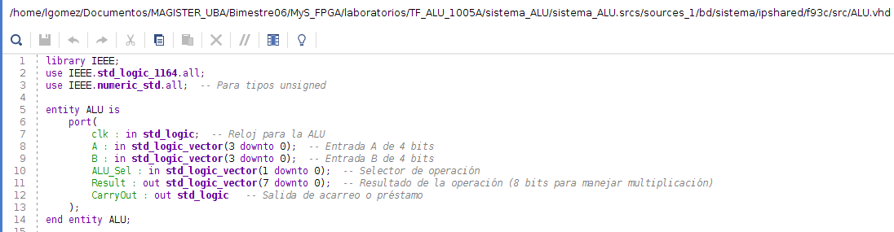
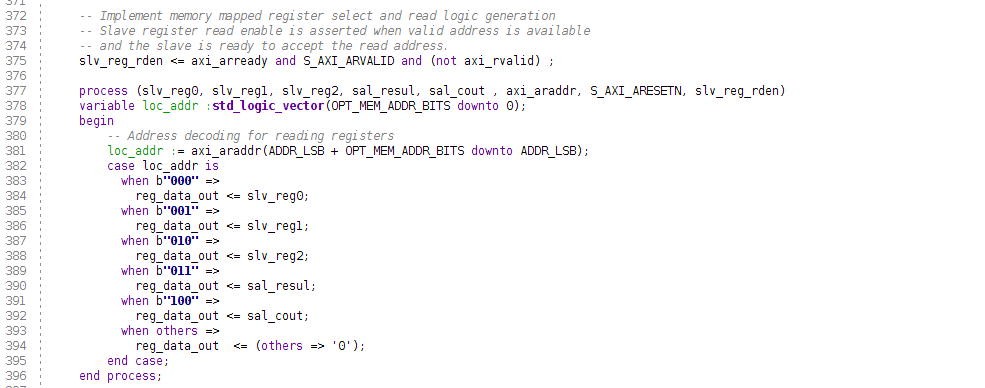
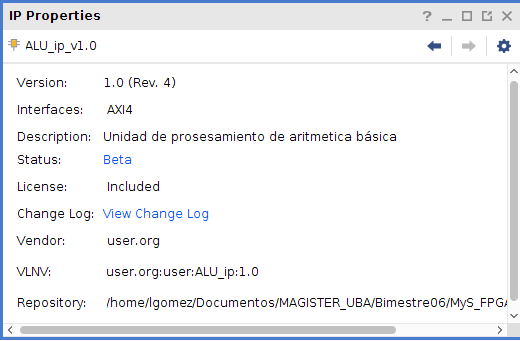
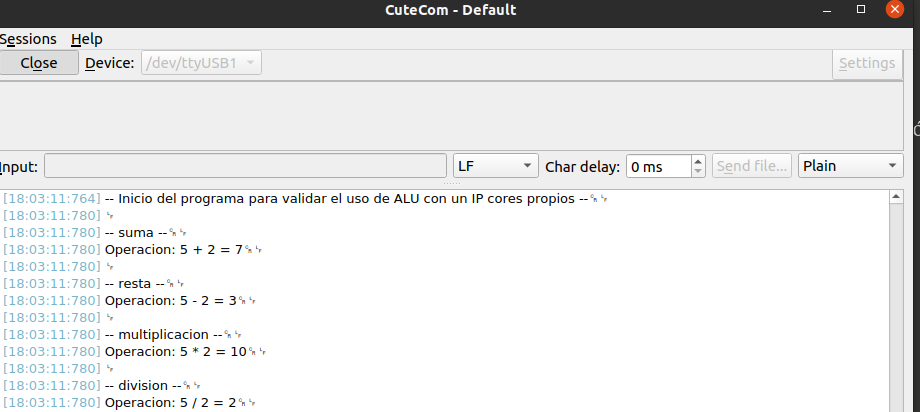

# Implementación de IP Core ALU en Arty Z7

## 1. Introducción
- Objetivo: Crear un IP Core ALU personalizado para la plataforma Zynq
- Plataforma: Arty Z7 (Zynq-7000 SoC)

## 2. Arquitectura del Sistema
```
+---------------------+        +------------------------+
|    Zynq PS          |        |     Zynq PL (FPGA)     |
|  +-------------+    |        |  +------------------+  |
|  | ARM Cortex  |    |        |  |                  |  |
|  |    A9       |<---+--------+->|   ALU IP Core    |  |
|  |  Processor  |    |  AXI   |  |                  |  |
|  +-------------+    |        |  +------------------+  |
|        |            |        |                        |
|        v            |        |                        |
|  +-------------+    |        |                        |
|  |    UART     |    |        |                        |
|  +-------------+    |        |                        |
+---------------------+        +------------------------+
```


## 3. Componentes Principales
### 3.1 IP Core ALU
- Operaciones: Suma, Resta, Multiplicación, División
- Interfaz: AXI4-Lite
- Registros:
  - Reg0: Operando A
  - Reg1: Operando B
  - Reg2: Selector de operación
  - Reg3: Resultado
  - Reg4: Carry/Overflow
  
  




### 3.2 Procesador ARM Cortex-A9
- Ejecuta el código C
- Controla la ALU a través de la interfaz AXI

### 3.3 UART
- Utilizada para la comunicación con el PC


## 4. Flujo de Diseño
1. Crear IP Core ALU en VHDL (Realizado en el curso anterior)
2. Empaquetar IP Core usando Vivado IP Packager
3. Implementación de Microprocesador Cortex A9
3. Integrar IP Core en el diseño de bloques de Vivado
4. Generar bitstream
5. Exportar hardware al SDK
6. Desarrollar aplicación C en SDK
7. Programar, compilar y ejecutar código C


## 5. Resultados principales

### 5.1 Implementación del IP Core ALU


-  

```vhdl
entity ALU is
    Port ( A, B : in STD_LOGIC_VECTOR(3 downto 0); -- variables de entrada
           ALU_Sel : in STD_LOGIC_VECTOR(1 downto 0); -- selector de operación (+,-,x y /)
           Result : out STD_LOGIC_VECTOR(7 downto 0);  -- resultado
           CarryOut : out STD_LOGIC); -- carry out
end ALU;

architecture Behavioral of ALU is
    -- Implementación de las operaciones
end Behavioral;
```





### 5.2 Código C de Control

- Código en C que permite la prueba de funcionamiento de la ALU

```c
#include "xparameters.h"
#include "xil_io.h"
#include "ALU_ip.h"
#include <stdint.h>
#include "sleep.h"  // Para usar usleep

#define MASK_4BIT 0x0F
#define MASK_8BIT 0xFF

#define SUMA 0
#define RESTA 1
#define MULTIPLICACION 2
#define DIVISION 3


void ALU(uint8_t opA,uint8_t  opB,uint8_t select){
	    uint32_t res;
		ALU_IP_mWriteReg(XPAR_ALU_IP_0_S_AXI_BASEADDR, ALU_IP_S_AXI_SLV_REG0_OFFSET, opA & MASK_4BIT);
		ALU_IP_mWriteReg(XPAR_ALU_IP_0_S_AXI_BASEADDR, ALU_IP_S_AXI_SLV_REG1_OFFSET, opB & MASK_4BIT);
		ALU_IP_mWriteReg(XPAR_ALU_IP_0_S_AXI_BASEADDR, ALU_IP_S_AXI_SLV_REG2_OFFSET, select & 0x03);

		usleep(100);

		res = ALU_IP_mReadReg(XPAR_ALU_IP_0_S_AXI_BASEADDR, ALU_IP_S_AXI_SLV_REG3_OFFSET);


	    xil_printf("Operacion: %d %s %d = %d\r\n",
	               opA,
	               (select == SUMA) ? "+" :
	               (select == RESTA) ? "-" :
	               (select == MULTIPLICACION) ? "*" : "/",
	               opB,
	               res & 0xFFFF);

}

int main(void) {
	uint8_t opA = 5;
	uint8_t opB = 2;


    xil_printf("-- Inicio del programa para validar el uso de ALU con un IP cores propios --\r\n");

    xil_printf("\n-- suma --\r\n");
    ALU(opA, opB, SUMA);
    xil_printf("\n-- resta --\r\n");
    ALU(opA, opB, RESTA);
    xil_printf("\n-- multiplicacion --\r\n");
    ALU(opA, opB, MULTIPLICACION);
    xil_printf("\n-- division --\r\n");
    ALU(opA, opB, DIVISION);

    xil_printf("--------------------------------------------\n\n");

	opA = 4;
    opB = 4;

    xil_printf("\n-- suma --\r\n");
    ALU(opA, opB, SUMA);
    xil_printf("\n-- resta --\r\n");
    ALU(opA, opB, RESTA);
    xil_printf("\n-- multiplicacion --\r\n");
    ALU(opA, opB, MULTIPLICACION);
    xil_printf("\n-- division --\r\n");
    ALU(opA, opB, DIVISION);

    return 0;
}
```

## 7. Resultados y Verificación
- Capturas de pantalla UART con los resultados de la operaciones




## 8. Conclusiones
- Desafíos encontrados:
  - Reescribir  la ALU para adecuarse al IP Core (por ejemplo eliminar Lilo)
  - Configurar adecuadamente el tamaño de las señales en los registros 
  
- Posibles mejoras futuras:
  - Ampliar la ALU para palabras de 32 bits 
  - Implementar cálculos con float.

## 9. Video Implementación 

[Enlace Video](https://youtu.be/IoH55Q6pCHo) 

