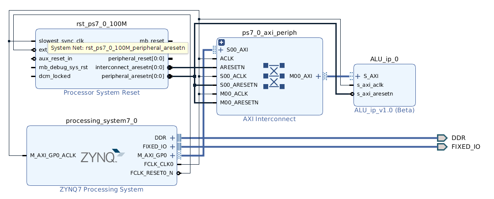

# Implementación de IP Core ALU en Arty Z7

## 1. Introducción
- **Objetivo**: Crear e integrar un IP Core ALU personalizado en la plataforma Zynq
- **Plataforma**: Arty Z7 (Zynq-7000 SoC)
- **Relevancia**: Demostrar la capacidad de crear y utilizar IP cores personalizados en sistemas embebidos
- **Aplicaciones**: Procesamiento de señales, cálculos en tiempo real, aceleración de algoritmos

## 2. Arquitectura del Sistema
```
+---------------------+        +------------------------+
|    Zynq PS          |        |     Zynq PL (FPGA)     |
|  +-------------+    |        |  +------------------+  |
|  | ARM Cortex  |    |        |  |                  |  |
|  |    A9       |<---+--------+->|   ALU IP Core    |  |
|  |  Processor  |    |  AXI   |  |                  |  |
|  +-------------+    |        |  +------------------+  |
|        |            |        |                        |
|        v            |        |                        |
|  +-------------+    |        |                        |
|  |    UART     |    |        |                        |
|  +-------------+    |        |                        |
+---------------------+        +------------------------+
```

## 3. Componentes Principales
### 3.1 IP Core ALU
- **Operaciones**: Suma, Resta, Multiplicación, División
- **Interfaz**: AXI4-Lite
- **Registros**:
  - Reg0: Operando A
  - Reg1: Operando B
  - Reg2: Selector de operación
  - Reg3: Resultado
  - Reg4: Carry/Overflow


### 3.2 Procesador ARM Cortex-A9
- Ejecuta el código C
- Controla la ALU a través de la interfaz AXI Lite

### 3.3 UART
- Utilizada para la comunicación con el PC

## 4. Flujo de Diseño Detallado
1. **Creación del IP Core ALU**:
   - Diseño en VHDL
   - Simulación y verificación funcional
2. **Empaquetado del IP Core**:
   - Uso de Vivado IP Packager
   - Definición de interfaces y parámetros
3. **Implementación del Sistema de Procesamiento**:
   - Configuración del Zynq PS
   - Habilitación de periféricos necesarios
4. **Integración del IP Core**:
   - Adición al diseño de bloques de Vivado
   - Conexión mediante AXI4-Lite
5. **Generación del Bitstream**:
   - Síntesis y implementación del diseño
   - Generación del archivo de configuración FPGA
6. **Desarrollo de Software**:
   - Exportación del hardware al SDK
   - Creación de la aplicación de prueba en C
7. **Verificación y Pruebas**:
   - Programación de la FPGA
   - Ejecución y depuración del código C

## 5. Implementación del IP Core ALU

### 5.1 Diseño VHDL
```vhdl
entity ALU is
    Port ( A, B : in STD_LOGIC_VECTOR(3 downto 0);
           ALU_Sel : in STD_LOGIC_VECTOR(1 downto 0);
           Result : out STD_LOGIC_VECTOR(7 downto 0);
           CarryOut : out STD_LOGIC);
end ALU;

architecture Behavioral of ALU is
    -- Implementación de las operaciones
end Behavioral;
```


### 5.2 Integración del IP Core

- Módulo que implementa la lógica de interfaz AXI, y un ejemplo de diseño para
escribir hacia y leer desde un número de registros especificados arriba. Esta plantilla mostrada en la figura es usada como base para crear la IP personalizada.


- Implementación de la ALU como un IP Core


### 5.3 Sistema Completo

-  Sistema de procesamiento con el agregado de la IP propia




- Generar las salidas de IP Integrator, el HDL top-level, y ejecutar el SDK
exportando el hardware.


## 6. Desarrollo de Software en SDK

### 6.1 Ejemplo de código C de Control
```c
void ALU(uint8_t opA, uint8_t opB, uint8_t select) {
    uint32_t res;
    ALU_IP_mWriteReg(XPAR_ALU_IP_0_S_AXI_BASEADDR, ALU_IP_S_AXI_SLV_REG0_OFFSET, opA & MASK_4BIT);
    ALU_IP_mWriteReg(XPAR_ALU_IP_0_S_AXI_BASEADDR, ALU_IP_S_AXI_SLV_REG1_OFFSET, opB & MASK_4BIT);
    ALU_IP_mWriteReg(XPAR_ALU_IP_0_S_AXI_BASEADDR, ALU_IP_S_AXI_SLV_REG2_OFFSET, select & 0x03);

    usleep(100);

    res = ALU_IP_mReadReg(XPAR_ALU_IP_0_S_AXI_BASEADDR, ALU_IP_S_AXI_SLV_REG3_OFFSET);

    xil_printf("Operacion: %d %s %d = %d\r\n",
               opA,
               (select == SUMA) ? "+" :
               (select == RESTA) ? "-" :
               (select == MULTIPLICACION) ? "*" : "/",
               opB,
               res & 0xFFFF);
}

// ... (resto del código main)
```

## 7. Resultados y Verificación


## 8. Lecciones Aprendidas y Desafíos
- **Desafíos Superados**:
  - Reescritura de la ALU para adaptarla al formato de IP Core
  - Configuración precisa del tamaño de señales en los registros AXI
- **Lecciones Clave**:
  - Importancia de la planificación cuidadosa de la interfaz AXI
  - Necesidad de una verificación exhaustiva en cada etapa del diseño

## 9. Conclusiones y Trabajo Futuro
- **Logros**:
  - Implementación exitosa de un IP Core ALU personalizado
  - Integración efectiva entre el PS y PL del Zynq SoC
- **Impacto**:
  - Demostración de la flexibilidad y potencial de los sistemas SoC
  - Base para el desarrollo de sistemas embebidos más complejos
- **Mejoras Futuras**:
  - Ampliación a ALU de 32 bits para mayor precisión
  - Implementación de operaciones con punto flotante
  - Optimización del rendimiento y consumo de recursos

## 10. Recursos Adicionales
- [Video de Implementación](https://youtu.be/IoH55Q6pCHo)
- Documentación de Xilinx Vivado y Zynq-7000 SoC
- Repositorio del proyecto (enlace GitHub)

